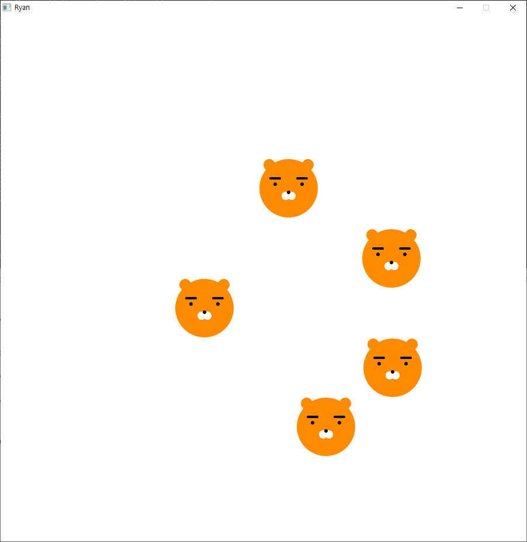

# 비주얼 라이브러리 사용하기

# Windows (64-bit)

## 1. Install Go Compiler  
파일 다운로드 후 실행파일 실행  
https://golang.org/doc/install?download=go1.13.windows-amd64.msi

## 2. Install git  
파일 다운로드 후 실행파일 실행  
https://git-scm.com/downloads

```
git이 이미 설치되었는지 & 잘 설치됐는지 확인하려면
cmd창에서 git --version 을 쳐봅니다
```

## 3. Install gcc & 환경변수 설정  
https://sourceforge.net/projects/mingw-w64/

```
1. 파일 다운로드 후 파일 실행
2. Architecture를 i686에서 x86_64로 변경 후 설치
3. 설치 완료 후 환경변수 설정하기
  - 제어판 > 시스템 > 고급 시스템 설정 > 환경변수 설정 창 열기
  - 사용자 변수, 시스템 변수에 있는 path 변수에 gcc가 설치된 경로 추가
    (mingw64가 설치된 경롤 이동해서 bin 폴더까지 이동, 아래와 같은 경로를 추가합니다.
      C:\Program Files\mingw-w64\x86_64-8.1.0-posix-seh-rt_v6-rev0\mingw64\bin)
```
참고 캡처


## 4. Install `canvas` package (https://github.com/h8gi/canvas)  
`go get -u github.com/h8gi/canvas`

## 5. 소스코드 다운로드 및 실행
`go run ryan.go`

---
# mac OS

## 1. Install Go Compiler  
운영체제에 맞는 파일 다운로드 후 실행파일 실행  
https://golang.org/dl/

## 2. Install git  
운영체제에 맞는 파일 다운로드 후 실행파일 실행  
https://git-scm.com/downloads

## 3. Install `canvas` package (https://github.com/h8gi/canvas)  
`go get -u github.com/h8gi/canvas`

## 4. 소스코드 다운로드 및 실행
`go run ryan.go`

---

